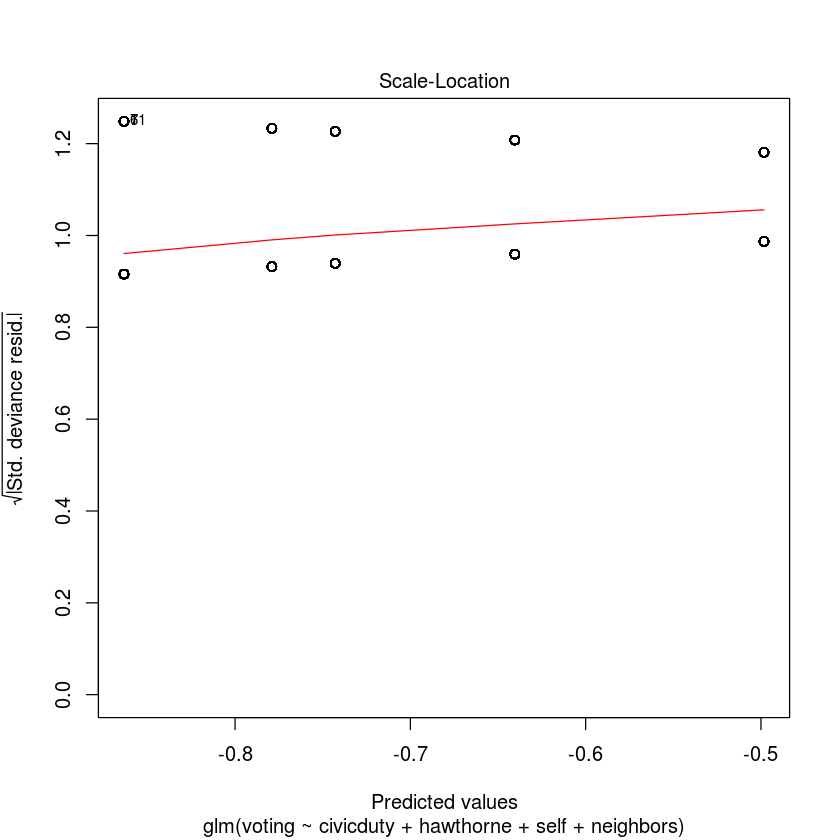

# ML_Assignment02_Ghasemi_NoOne
# Mohammad Sadegh Ghasemi


```R
# Loading the dataset
setwd('/home/mohammad/cpas/exercises/ML-Taherian/Assignment02/ML_Assignment02_Ghasemi_NoOne/‫‪ML_Problem21_Ghasemi_NoOne')
gerber <- read.csv('gerber.csv')
str(gerber)
```

    'data.frame':	344084 obs. of  8 variables:
     $ sex      : int  0 1 1 1 0 1 0 0 1 0 ...
     $ yob      : int  1941 1947 1982 1950 1951 1959 1956 1981 1968 1967 ...
     $ voting   : int  0 0 1 1 1 1 1 0 0 0 ...
     $ hawthorne: int  0 0 1 1 1 0 0 0 0 0 ...
     $ civicduty: int  1 1 0 0 0 0 0 0 0 0 ...
     $ neighbors: int  0 0 0 0 0 0 0 0 0 0 ...
     $ self     : int  0 0 0 0 0 0 0 0 0 0 ...
     $ control  : int  0 0 0 0 0 1 1 1 1 1 ...


## Question 1

### How many peaple have voted?


```R
(voting_table = table(gerber$voting))
```


    
         0      1 
    235388 108696 


### What percentage of people have voted?


```R
print(mean(gerber$voting))
# print(as.numeric(voting_table[2] / sum(voting_table)))
```

    [1] 0.3158996


### Which of the four “treatment groups” had the largest percentage of people who actually voted (voting = 1)?


```R
max_voted.group = ''
max_voted.percentage = 0
for (group in names(gerber)[4:length(names(gerber))]) {
    vote_percentage = round(mean(gerber[gerber[group] == 1, ]$voting) * 100)
    print(paste(sep='', group, ': ', vote_percentage, '% voted'))
    if (max_voted.percentage < vote_percentage) {
        max_voted.group = group
        max_voted.percentage = vote_percentage
    }
}
writeLines(paste('\n', max_voted.group, 'group had the largest percentage of people who voted'))
```

    [1] "hawthorne: 32% voted"
    [1] "civicduty: 31% voted"
    [1] "neighbors: 38% voted"
    [1] "self: 35% voted"
    [1] "control: 30% voted"
    
     neighbors group had the largest percentage of people who voted


## Question 2

### Build a logistic regression model for voting using the "civicduty, hawthorne, self, neighbors" as the independent variables.
### Which of the variables are significant in the logistic regression model?


```R
logistic_model <- glm(voting ~ civicduty + hawthorne + self + neighbors, data = gerber, family = binomial)

summary(logistic_model)
# All 4 variables "civicduty", "hawthorne", "self", "neighbors" are significant.
```


    
    Call:
    glm(formula = voting ~ civicduty + hawthorne + self + neighbors, 
        family = binomial, data = gerber)
    
    Deviance Residuals: 
        Min       1Q   Median       3Q      Max  
    -0.9744  -0.8691  -0.8389   1.4586   1.5590  
    
    Coefficients:
                 Estimate Std. Error  z value Pr(>|z|)    
    (Intercept) -0.863358   0.005006 -172.459  < 2e-16 ***
    civicduty    0.084368   0.012100    6.972 3.12e-12 ***
    hawthorne    0.120477   0.012037   10.009  < 2e-16 ***
    self         0.222937   0.011867   18.786  < 2e-16 ***
    neighbors    0.365092   0.011679   31.260  < 2e-16 ***
    ---
    Signif. codes:  0 ‘***’ 0.001 ‘**’ 0.01 ‘*’ 0.05 ‘.’ 0.1 ‘ ’ 1
    
    (Dispersion parameter for binomial family taken to be 1)
    
        Null deviance: 429238  on 344083  degrees of freedom
    Residual deviance: 428090  on 344079  degrees of freedom
    AIC: 428100
    
    Number of Fisher Scoring iterations: 4


```R
# plotting model
plot(logistic_model)
```





### Using a threshold of 0.3, what is the accuracy of the logistic regression model?


```R
predict_logistic_model <- predict(logistic_model, type="response")
(confusion_matrix = table(gerber$voting, predict_logistic_model >= 0.3))
print(paste("Model accuracy with a threshold of 0.3:", sum(diag(confusion_matrix)) / sum(confusion_matrix)))
```


       
         FALSE   TRUE
      0 134513 100875
      1  56730  51966


    [1] "Model accuracy with a threshold of 0.3: 0.541957777751944"


### Using a threshold of 0.5, what is the accuracy of the logistic regression model?


```R
(confusion_matrix = table(gerber$voting, predict_logistic_model >= 0.5))
print(paste("Model accuracy with a threshold of 0.5:", confusion_matrix[1] / sum(confusion_matrix)))
```


       
         FALSE
      0 235388
      1 108696


    [1] "Model accuracy with a threshold of 0.5: 0.684100394089815"


### Compare your model accuracy to the accuracy of the bellow baseline models
### -All people vote
### -No one vote


```R
all_people_model_accuracy = nrow(subset(gerber, gerber$voting == 1)) / nrow(gerber)
no_one_model_accuracy = nrow(subset(gerber, gerber$voting == 0)) / nrow(gerber)
print(paste("Accuracy of the model in which all people vote:", all_people_model_accuracy))
print(paste("Accuracy of the model in which no one vote:", no_one_model_accuracy))
# Our model accuracy with thresholds of 0.5, 0.3 was 0.68, 0.54 respectively
# so it's not better than the second baseline model
```

    [1] "Accuracy of the model in which all people vote: 0.315899605910185"
    [1] "Accuracy of the model in which no one vote: 0.684100394089815"


### Compare the AUC of the model with the AUC of the baseline model.


```R
# AUC of the model
library(ROCR)
ROCRpred = prediction(predict_logistic_model, gerber$voting)
auc = as.numeric(performance(ROCRpred, "auc")@y.values)

# AUC of the baseline models
baseline_ROCRpred = prediction(floor(predict_logistic_model), gerber$voting)
baseline_auc = as.numeric(performance(baseline_ROCRpred, "auc")@y.values)
# baseline_ROCRpred = prediction(ceiling(predict_logistic_model), gerber$voting)
# baseline_auc = as.numeric(performance(baseline_ROCRpred, "auc")@y.values)

writeLines(paste(
    "Our model AUC:", round(auc, 4),
    "\nbaseline model AUC:", round(baseline_auc, 4)))
# Our model is a weak predictive model, but a little bit better than baseline model
```

    Our model AUC: 0.5308 
    baseline model AUC: 0.5


```R
# plotting performance
perf_tpr_fpr = performance(ROCRpred, "tpr", "fpr")
perf_prec_rec = performance(ROCRpred, "prec", "rec")
perf_sens_spec = performance(ROCRpred, "sens", "spec")

# true_positive_rate/true_negative_rate curve
plot(perf_tpr_fpr)
# precision/recall curve
plot(perf_prec_rec)
# sensitivity/specificity curve
plot(perf_sens_spec)
```


## Question 3

### Build a CART tree for voting using all data and the "civicduty, hawthorne, self, neighbors" variables.


```R
library(rpart)
library(rpart.plot)
CART_model1 <- rpart(voting ~ civicduty + hawthorne + self + neighbors, data = gerber)
prp(CART_model1)
# There are no splits in the tree, because none of the variables make a big enough effect to be split on.
```


## Question 4

### Use the parameter cp (cp=0.0) to build the tree.


```R
CARTmodel2 = rpart(voting ~ civicduty + hawthorne + self + neighbors, data=gerber, cp=0.0)
prp(CARTmodel2)
```


```R
summary(CARTmodel2)
```

    Call:
    rpart(formula = voting ~ civicduty + hawthorne + self + neighbors, 
        data = gerber, cp = 0)
      n= 344084 
    
                CP nsplit rel error    xerror        xstd
    1 0.0022249213      0 1.0000000 1.0000055 0.001350270
    2 0.0008041280      1 0.9977751 0.9977857 0.001355053
    3 0.0002280601      2 0.9969710 0.9969953 0.001356423
    4 0.0001372415      3 0.9967429 0.9967704 0.001356730
    5 0.0000000000      4 0.9966056 0.9966364 0.001356892
    
    Variable importance
    neighbors      self hawthorne civicduty 
           66        24         7         4 
    
    Node number 1: 344084 observations,    complexity param=0.002224921
      mean=0.3158996, MSE=0.216107 
      left son=2 (305883 obs) right son=3 (38201 obs)
      Primary splits:
          neighbors < 0.5 to the left,  improve=2.224921e-03, (0 missing)
          self      < 0.5 to the left,  improve=4.947386e-04, (0 missing)
          hawthorne < 0.5 to the left,  improve=2.423094e-05, (0 missing)
          civicduty < 0.5 to the right, improve=1.072488e-06, (0 missing)
    
    Node number 2: 305883 observations,    complexity param=0.000804128
      mean=0.3081505, MSE=0.2131938 
      left son=4 (267665 obs) right son=5 (38218 obs)
      Primary splits:
          self      < 0.5 to the left,  improve=9.169142e-04, (0 missing)
          hawthorne < 0.5 to the left,  improve=1.354474e-04, (0 missing)
          civicduty < 0.5 to the left,  improve=2.732223e-05, (0 missing)
    
    Node number 3: 38201 observations
      mean=0.3779482, MSE=0.2351034 
    
    Node number 4: 267665 observations,    complexity param=0.0002280601
      mean=0.3028674, MSE=0.2111387 
      left son=8 (229461 obs) right son=9 (38204 obs)
      Primary splits:
          hawthorne < 0.5 to the left,  improve=0.0003000705, (0 missing)
          civicduty < 0.5 to the left,  improve=0.0001074432, (0 missing)
    
    Node number 5: 38218 observations
      mean=0.3451515, MSE=0.2260219 
    
    Node number 8: 229461 observations,    complexity param=0.0001372415
      mean=0.2996195, MSE=0.2098477 
      left son=16 (191243 obs) right son=17 (38218 obs)
      Primary splits:
          civicduty < 0.5 to the left,  improve=0.0002119365, (0 missing)
    
    Node number 9: 38204 observations
      mean=0.3223746, MSE=0.2184492 
    
    Node number 16: 191243 observations
      mean=0.2966383, MSE=0.208644 
    
    Node number 17: 38218 observations
      mean=0.3145377, MSE=0.2156037 
    


### What is the order of branching?
#### The highest fraction of voters are in the Neighbors, Self, Hawthorne and Civic Duty groups respectively.

## Question 5

### Using only the CART tree plot, determine what fraction of "Civic Duty" group voted?
#### 0.31

## Question 6

### Add "sex" to the variables used before, again with cp = 0.0.


```R
CARTmodel3 = rpart(voting ~ civicduty + hawthorne + self + neighbors + sex + control, data=gerber, cp=0.0)
prp(CARTmodel3)
```


### Pay attention to the importance of the sex variable.
#### sex is the least important variable.
### In the control group, which gender is more likely to vote?
##### Men

### What about "civic duty" group?
#### Men

## Question 7

### Create a regression tree using just the "control" variable.
### Also create a tree with the "control" and "sex" variables.
### Set cp=0.0 for both of above trees.


```R
CARTcontrol_tree = rpart(voting ~ control, data=gerber, cp=0.0)
CARTcontrol_sex_tree = rpart(voting ~ control + sex, data=gerber, cp=0.0)
prp(CARTcontrol_tree, digits=6)
prp(CARTcontrol_sex_tree, digits=6)
```


### What is the absolute difference in the predicted probability of voting between being in the control group versus being in other group's, In the "control" only tree?
### ‫‪abs(control prediction - non-control prediction).


```R
control_splitted_voting = CARTcontrol_tree$frame$yval[CARTcontrol_tree$frame$var == "<leaf>"]
print(abs(control_splitted_voting[1] - control_splitted_voting[2]))
```

    [1] 0.04336208


### Now, using the second tree, determine what gender is affected more by NOT being in the control group


```R
c_s_splitted_voting = CARTcontrol_sex_tree$frame$yval[CARTcontrol_sex_tree$frame$var == "<leaf>"]
affected_women = abs(c_s_splitted_voting[1] - c_s_splitted_voting[3])
affected_men = abs(c_s_splitted_voting[2] - c_s_splitted_voting[4])
writeLines(paste(
    "The amount of affected men:", round(affected_men, 6),
    "\nThe amount of affected women:", round(affected_women, 6),
    "\nWomen are more affected about:", round(affected_women - affected_men, 6),
    "\nSo they are affected about the same because the difference is very small."
    ))
```

    The amount of affected men: 0.043024 
    The amount of affected women: 0.04372 
    Women are more affected about: 0.000696 
    So they are affected about the same because the difference is very small.


## Question 8

### Go back to logistic regression. Create a model using "sex" and "control".


```R
sex_control_log_model = glm(voting ~ control + sex, data=gerber, family="binomial")
summary(sex_control_log_model)
```


    
    Call:
    glm(formula = voting ~ control + sex, family = "binomial", data = gerber)
    
    Deviance Residuals: 
        Min       1Q   Median       3Q      Max  
    -0.9220  -0.9012  -0.8290   1.4564   1.5717  
    
    Coefficients:
                 Estimate Std. Error z value Pr(>|z|)    
    (Intercept) -0.635538   0.006511 -97.616  < 2e-16 ***
    control     -0.200142   0.007364 -27.179  < 2e-16 ***
    sex         -0.055791   0.007343  -7.597 3.02e-14 ***
    ---
    Signif. codes:  0 ‘***’ 0.001 ‘**’ 0.01 ‘*’ 0.05 ‘.’ 0.1 ‘ ’ 1
    
    (Dispersion parameter for binomial family taken to be 1)
    
        Null deviance: 429238  on 344083  degrees of freedom
    Residual deviance: 428443  on 344081  degrees of freedom
    AIC: 428449
    
    Number of Fisher Scoring iterations: 4


### What is the coefficient for "sex" and what does it mean?


```R
as.numeric(sex_control_log_model$coefficients['sex'])
```


-0.0557910657046101


#### This means that women are less likely to vote, since sex variable is 1 for women, and a negative coefficient means that larger values are predictive of 0.

### What is the absolute difference between the logistic regression and the decision tree prediction for the (Woman, Control)?


```R
woman_control = data.frame(sex=1, control=1)
woman_control_predict = as.numeric(
    predict(sex_control_log_model, newdata=woman_control, type='response'))
print(round(abs(woman_control_predict - c_s_splitted_voting[1]), 5))
```

    [1] 0.00035


### Add combination of "sex" and "control" to logistic regression as a new variable. 1 if person is woman and belongs to control group


```R
sex_control_combination_lm = glm(
    voting ~ sex + control + sex:control,
    data=gerber, family="binomial")
summary(sex_control_combination_lm)
```


    
    Call:
    glm(formula = voting ~ sex + control + sex:control, family = "binomial", 
        data = gerber)
    
    Deviance Residuals: 
        Min       1Q   Median       3Q      Max  
    -0.9213  -0.9019  -0.8284   1.4573   1.5724  
    
    Coefficients:
                 Estimate Std. Error z value Pr(>|z|)    
    (Intercept) -0.637471   0.007603 -83.843  < 2e-16 ***
    sex         -0.051888   0.010801  -4.804 1.55e-06 ***
    control     -0.196553   0.010356 -18.980  < 2e-16 ***
    sex:control -0.007259   0.014729  -0.493    0.622    
    ---
    Signif. codes:  0 ‘***’ 0.001 ‘**’ 0.01 ‘*’ 0.05 ‘.’ 0.1 ‘ ’ 1
    
    (Dispersion parameter for binomial family taken to be 1)
    
        Null deviance: 429238  on 344083  degrees of freedom
    Residual deviance: 428442  on 344080  degrees of freedom
    AIC: 428450
    
    Number of Fisher Scoring iterations: 4


### How the new variable (sex:control) related to the output(dependent variable)?
#### Variable coefficient is negative (-0.007259), so a value of 1 in this variable decreases the chance of voting. If the person is a woman belonging to the control group, there is less chance that she will vote.

### What is the absolute difference between the last logistic regression model and the decision tree prediction for the (Woman, Control)?


```R
woman_control_predict = as.numeric(
    predict(sex_control_combination_lm, newdata=woman_control, type='response'))
print(round(abs(woman_control_predict - c_s_splitted_voting[1]), 5))
```

    [1] 0

