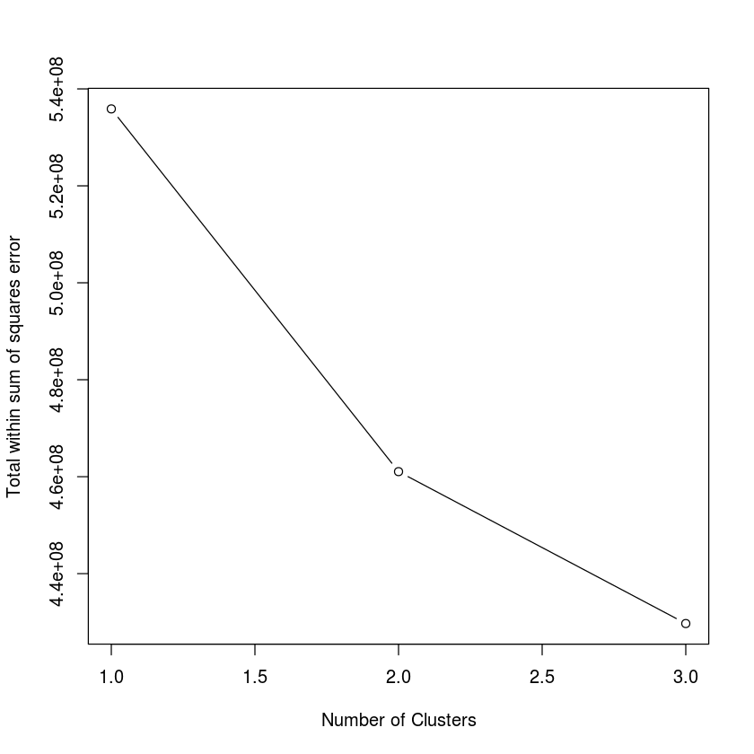
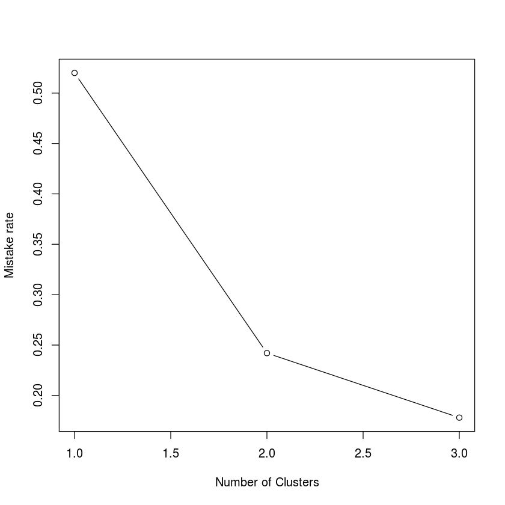
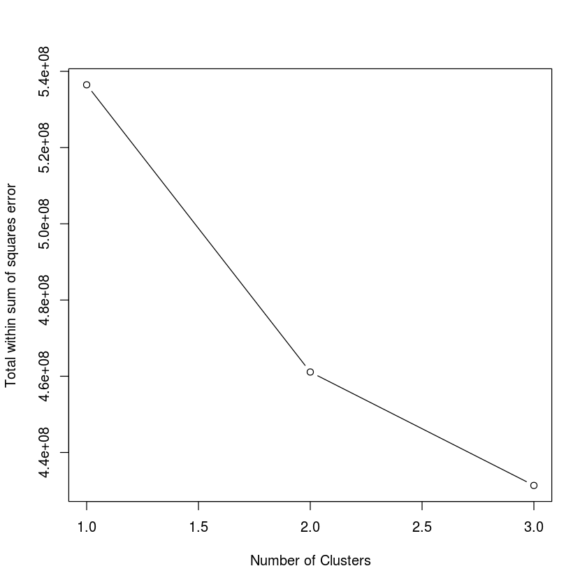
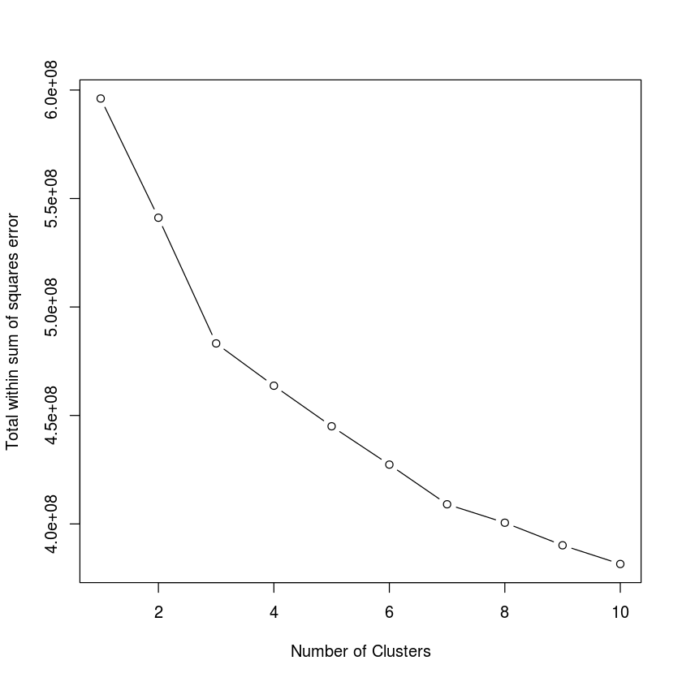
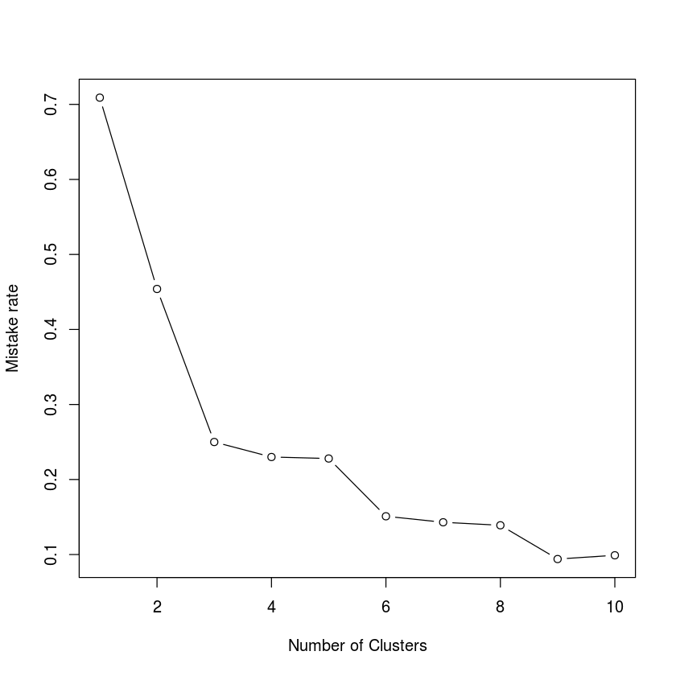
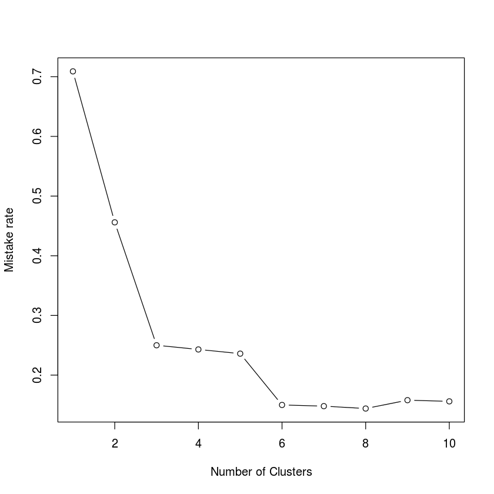
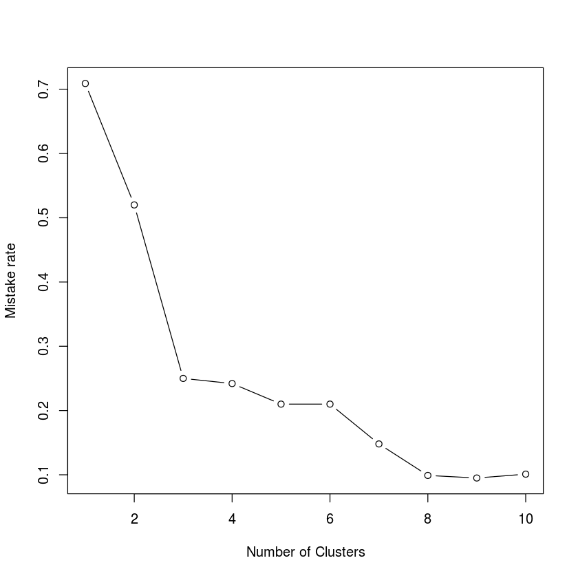

# ML_Assignment03_Ghasemi_NoOne
# Mohammad Sadegh Ghasemi


```R
# KMeans Implementation
initialize <- function(X, k, random_centers=TRUE) {
    #' initializes the centers
    if (random_centers) {idxs = sample(dim(X)[1], k)}
    else {idxs = 1:k}
    Mu = X[idxs, ]
    return(Mu)
}

assign <- function(X, Mu) {
    #' assigns data to the closest center
    N = nrow(X)
    k = nrow(Mu)
    z = matrix(0, N, k)
    for (j in 1:k){
        z[, j] = rowSums(sweep(as.matrix(X), 2, as.matrix(Mu)[j, ], '-') ** 2)
    }

    return(apply(z, 1, which.min))
}

updateCenters <- function(X, z, k) {
    N = nrow(X)
    D = ncol(X)
    Mu = matrix(0, k, D)
    counts = tabulate(z)
    for (j in 1:k){
        Mu[j, ] = colSums(X[z == j, ]) / counts[j]
    }
    return(Mu)
}

compute_total_withinss <- function(X, Mu, z) {
    tot.withinss = 0
    for (j in 1:nrow(Mu)){
        tot.withinss = (
            tot.withinss +
            sum(sweep(as.matrix(X)[z == j, ], 2, as.matrix(Mu)[j, ], '-') ** 2)
        )
    }
    return(tot.withinss)
}

labelize_and_compute_mistake_rate <- function(clust, y, k){
    mistake = 0
    labels = numeric()
    for (i in 1:k) {
        i.digits = y[clust[[2]] == i,]
        i.uniqueDigits = unique(i.digits)
        i.label = -1
        i.labelCount = -1
        i.label = c(0, 0)
        for (digit in i.uniqueDigits) {
            digit.count = sum(i.digits == digit)
            if (digit.count > i.label[2]) {
                i.label = c(digit, digit.count)
            }
            else if (digit.count == i.label[2] && digit < i.label[1]) {
                i.label = c(digit, digit.count)
            }
        }
        labels[i] = i.label[1]
        mistake = mistake + length(i.digits) - i.label[2]
    }
    clust[[length(clust) + 1]] = labels
    clust[[length(clust) + 1]] = mistake / nrow(X)
    return(clust)
}

doCluster <- function(X, k, random_centers, iter.max) {
    Mu = initialize(X, k, random_centers)
    N = nrow(X)
    z = rep(-1, N)  # So that initially all assignments change.
    for (iter in 1:iter.max) {
        old_z = z
        z = assign(X, Mu)  # The vector of assignments z.
        Mu = updateCenters(X, z, k)  # Update the centroids
        if (all(z == old_z)) {  # Stop condition
            break
        }
    }
    total.withinss = compute_total_withinss(X, Mu, z)
    return(list(Mu, z, total.withinss, iter))
}

custom_kmeans <- function(X, y, k, random_centers=TRUE, iter.max=10, nstart=1) {
    #' This function does clustering and returns a list object cluster as follow:
    #' clust[[1]] = Mu,  # the centers of clusters
    #' clust[[2]] = z,  # specifies which cluster data belongs to, z[1]: cluster of X[1,]
    #' clust[[3]] = total.withinss,  # Total within sum of squares errors
    #' clust[[4]] = iter,  # the number of iterations
    #' clust[[5]] = labels,  # specifies the label of each cluster
    #' clust[[6]] = mistake rate, (the number of iterations)

    results = list()
    for (i in 1:nstart){
        results[[i]] = doCluster(X, k, random_centers, iter.max)
    }
    best_res_total.withinss = Inf
    best_res_idx = 0
    for (i in 1:length(results)) {
        if (results[[i]][[3]] < best_res_total.withinss) {
            best_res_total.withinss = results[[i]][[3]]
            best_res_idx = i
        }
    }
    best = results[[best_res_idx]]
    best = labelize_and_compute_mistake_rate(best, y, k)
    return(best)
}
```


```R
# Functions for creating a table containing
# "number of iterations", "total within sum of square errors" and "mistake rate"
computeMistakeRate = function(clust, y) {
    mistake = 0
    for (i in 1:dim(clust$centers)[1]) {
        i.digits = y[clust$cluster == i,]
        i.uniqueDigits = unique(i.digits)
        i.label = c(0, 0)
        for (digit in i.uniqueDigits) {
            digit.count = sum(i.digits == digit)
            if (digit.count > i.label[2]) {
                i.label = c(digit, digit.count)
            }
            else if (digit.count == i.label[2] && digit < i.label[1]) {
                i.label = c(digit, digit.count)
            }
        }
        mistake = mistake + clust$size[i] - i.label[2]
    }
    mistake.rate = mistake / length(clust$cluster)
    return(mistake.rate)
}

# This function returns an info table using R kmeans function
compareClusters <- function(X, y, k, max_iter, random_centers=FALSE, nstart=1) {
    infoTableRowNames = c("Number of terations", "Total within SSE", "Mistake rate")
    infoTable = as.table(matrix(
        rep(0,length(k)*3),
        ncol=length(k),
        dimnames=list(infoTableRowNames, k)
    ))

    for (i in seq_along(k)) {
        if (random_centers) centers = k[i] else centers = X[1:k[i], ]

        # If a number passed to kmeans function as centers parameter,
        # a random set of (distinct) rows in ‘X’ is chosen as the initial centers.
        # It's also is possible to choose centers manually as follow:
        #     idxs = sample(dim(X)[1], i)
        #     centers = X[idxs, ]

        # nstart: if ‘centers’ is a number, how many random sets should be chosen?
        # A stupid way is as follow:
        # temp_tot.withinss = Inf
        # cluster = NULL
        # for (j in 1:nstart) {
        #     idxs = sample(nrow(X), k[i])
        #     temp_cluster = kmeans(X, centers=X[idxs, ], iter.max=max_iter)
        #     if (temp_cluster$tot.withinss < temp_tot.withinss) {
        #         temp_tot.withinss = temp_cluster$tot.withinss
        #         cluster = temp_cluster
        #     }
        # }
        i.cluster = kmeans(X, centers, iter.max=max_iter, nstart=nstart)

        infoTable[1, i] = i.cluster$iter
        infoTable[2, i] = i.cluster$tot.withinss
        infoTable[3, i] = computeMistakeRate(i.cluster, y)
    }
    return(infoTable)
}

# This function returns an info table using My own implementation of kmeans
myCompareClusters <- function(X, y, k, iter.max=max_iter, random_centers=FALSE, nstart=1) {
    infoTableRowNames = c("iteration", "tot.withinss", "mistake.rate")
    infoTable = as.table(matrix(
        rep(0,length(k)*3),
        ncol=length(k),
        dimnames=list(infoTableRowNames, k)
    ))

    for (i in seq_along(k)) {
        i.cluster = custom_kmeans(
            X, y, k[i], random_centers=random_centers,
            iter.max=max_iter, nstart=nstart)

        infoTable[1, i] = i.cluster[[4]]
        infoTable[2, i] = i.cluster[[3]]
        infoTable[3, i] = i.cluster[[6]]
    }
    return(infoTable)
}
```


```R
# Loading the data set
X = read.csv('digit.txt', header=FALSE, sep=' ')
y = read.csv('labels.txt', header=FALSE, sep='\n')
```

## Checking my custom kmeans function
### It is not a part of assignment questions


```R
# checking my custom kmeans function
k = 4
clusterk4 = custom_kmeans(X, y, k, random_centers=TRUE, iter.max=20)
writeLines(paste(
    "clustering with k =", k,
    "\niterations:", clusterk4[[4]],
    "\nTotal within SS:", clusterk4[[3]],
    "\nMistake Rate:", clusterk4[[6]]
))

k = 10
clusterk10 = custom_kmeans(X, y, k, random_centers=TRUE, iter.max=20)
writeLines(paste(
    "\nclustering with k =", k,
    "\niterations:", clusterk10[[4]],
    "\nTotal within SS:", clusterk10[[3]],
    "\nMistake Rate:", clusterk10[[6]]
))
```

    clustering with k = 4 
    iterations: 9 
    Total within SS: 463731397.653629 
    Mistake Rate: 0.232
    
    clustering with k = 10 
    iterations: 14 
    Total within SS: 384096215.108357 
    Mistake Rate: 0.096


# Question 2
## A
### Compute "total within sum of squares error" and "mistake rate" for k= 2, 4, 6 with first k items as initial centers and a 20 number of maximum iterations.


```R
max_iter = 20
nClusters = c(2, 4, 6)
```


```R
# using R kmeans function
infoTable1 = compareClusters(X, y, nClusters, max_iter, random_centers=FALSE)
print(round(infoTable1, 2))
plot(infoTable1[2, ], type="b", xlab="Number of Clusters", ylab="Total within sum of squares error")
plot(infoTable1[3, ], type="b", xlab="Number of Clusters", ylab="Mistake rate")
```

                                   2            4            6
    Number of terations         1.00         4.00         4.00
    Total within SSE    535871217.75 461044665.71 429703564.78
    Mistake rate                0.52         0.24         0.18








## using custom kmeans function


```R
infoTable2 = myCompareClusters(X, y, nClusters, max_iter, random_centers=FALSE)
print(round(infoTable2, 2))
plot(infoTable2[2, ], type="b", xlab="Number of Clusters", ylab="Total within sum of squares error")
plot(infoTable2[3, ], type="b", xlab="Number of Clusters", ylab="Mistake rate")
```

                            2            4            6
    iteration           20.00        11.00         8.00
    tot.withinss 536477102.54 461110943.96 431349182.92
    mistake.rate         0.52         0.24         0.18





## B
### Compute "total within sum of squares error" and "mistake rate" for k= 1:10 with random initial centers and a 20 number of maximum iterations.


```R
max_iter = 20
nClusters = 1:10
```


```R
# using R kmeans function
infoTable3 = compareClusters(X, y, nClusters, max_iter, random_centers=TRUE)
print(round(infoTable3, 2))
plot(infoTable3[2, ], type="b", xlab="Number of Clusters", ylab="Total within sum of squares error")
plot(infoTable3[3, ], type="b", xlab="Number of Clusters", ylab="Mistake rate")
```

                                   1            2            3            4
    Number of terations         1.00         1.00         4.00         4.00
    Total within SSE    596101560.35 541152561.23 483206922.63 463714022.62
    Mistake rate                0.71         0.45         0.25         0.23
                                   5            6            7            8
    Number of terations         4.00         5.00         5.00         7.00
    Total within SSE    445010505.85 427346329.50 409057697.65 400559497.54
    Mistake rate                0.23         0.15         0.14         0.14
                                   9           10
    Number of terations         6.00         7.00
    Total within SSE    390156370.68 381528599.14
    Mistake rate                0.09         0.10








## using custom kmeans function


```R
infoTable4 = myCompareClusters(X, y, nClusters, max_iter, random_centers=TRUE)
print(round(infoTable4, 2))
plot(infoTable4[2, ], type="b", xlab="Number of Clusters", ylab="Total within sum of squares error")
plot(infoTable4[3, ], type="b", xlab="Number of Clusters", ylab="Mistake rate")
```

                            1            2            3            4            5
    iteration            2.00        11.00        10.00        20.00        16.00
    tot.withinss 596101560.35 541152861.59 483206922.63 461070952.71 445289330.27
    mistake.rate         0.71         0.46         0.25         0.24         0.24
                            6            7            8            9           10
    iteration           12.00        20.00        13.00        13.00        16.00
    tot.withinss 427638027.08 411456386.50 411454720.21 391434055.19 385631787.39
    mistake.rate         0.15         0.15         0.14         0.16         0.16





## C
### Repeat section B with nstart 10


```R
max_iter = 20
nClusters = 1:10
nstart = 10
```


```R
# using R kmeans function
infoTable5 = compareClusters(X, y, nClusters, max_iter, random_centers=TRUE, nstart=nstart)
print(round(infoTable5, 2))
plot(infoTable5[2, ], type="b", xlab="Number of Clusters", ylab="Total within sum of squares error")
plot(infoTable5[3, ], type="b", xlab="Number of Clusters", ylab="Mistake rate")
```

                                   1            2            3            4
    Number of terations         1.00         1.00         4.00         5.00
    Total within SSE    596101560.35 535871217.75 483206922.63 461046841.41
    Mistake rate                0.71         0.52         0.25         0.24
                                   5            6            7            8
    Number of terations         4.00         4.00         5.00         5.00
    Total within SSE    441051064.94 422426719.46 408962054.03 399815747.15
    Mistake rate                0.21         0.21         0.15         0.10
                                   9           10
    Number of terations         8.00         6.00
    Total within SSE    390049706.68 381982059.78
    Mistake rate                0.10         0.10





## using custom kmeans function


```R
infoTable6 = myCompareClusters(X, y, nClusters, max_iter, random_centers=TRUE, nstart=nstart)
print(round(infoTable6, 2))
plot(infoTable6[2, ], type="b", xlab="Number of Clusters", ylab="Total within sum of squares error")
plot(infoTable6[3, ], type="b", xlab="Number of Clusters", ylab="Mistake rate")
```

                            1            2            3            4            5
    iteration            2.00        10.00        12.00        10.00        14.00
    tot.withinss 596101560.35 535871217.75 483206922.63 461069932.52 441162754.49
    mistake.rate         0.71         0.52         0.25         0.24         0.22
                            6            7            8            9           10
    iteration           20.00        14.00        19.00        20.00        12.00
    tot.withinss 422535216.91 409142721.35 399876055.45 391274598.57 383267147.51
    mistake.rate         0.21         0.15         0.10         0.15         0.12


